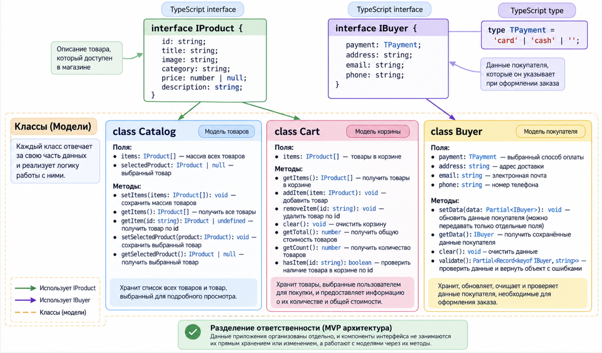

# Web-Larёk

Учебный проект интернет-магазина «Web-Larёk», реализованный на TypeScript.

Приложение позволяет просматривать каталог товаров, открывать подробную информацию о товаре, добавлять товары в корзину, оформлять заказ в два этапа и отправлять его на сервер.

## Стек

- TypeScript
- Vite
- HTML
- SCSS
- REST API
- npm

## Установка и запуск

Для работы необходимы Node.js и npm.

Установка зависимостей:

```bash
npm install
```

Запуск проекта в режиме разработки:

```bash
npm run dev
```

Сборка проекта:

```bash
npm run build
```

Локальный просмотр собранной версии:

```bash
npm run preview
```

## Архитектура

Приложение построено на основе архитектурного паттерна MVP (Model–View–Presenter) с событийным взаимодействием компонентов через Event Broker.

## Схема моделей данных



### Model

Модели хранят состояние приложения и реализуют бизнес-логику:

- `Catalog` — хранит каталог товаров и выбранный товар;
- `Cart` — управляет товарами в корзине;
- `Buyer` — хранит данные покупателя и выполняет их валидацию.

При изменении состояния модели генерируют события через Event Broker.

### View

Компоненты представления отвечают за отображение данных и взаимодействие пользователя с интерфейсом.

Основные компоненты:

- `Gallery` — отображение каталога товаров;
- `Card` — базовое представление карточки товара;
- `CardPreview` — подробное представление выбранного товара;
- `CardBasket` — представление товара в корзине;
- `Basket` — отображение содержимого корзины и общей стоимости;
- `Form` — базовая логика форм;
- `Modal` — управление модальными окнами;
- `Header` — отображение счётчика товаров в корзине.

Общая функциональность компонентов представления вынесена в базовый класс `Component`.

### Presenter

Роль Presenter выполняет точка входа приложения `main.ts`.

Presenter:

- создаёт экземпляры моделей и компонентов представления;
- подписывается на события Event Broker;
- реагирует на действия пользователя;
- передаёт данные между Model и View;
- обновляет интерфейс при изменении состояния;
- взаимодействует с API;
- формирует и отправляет заказ на сервер.

### Event Broker

Event Broker обеспечивает слабую связанность компонентов приложения.

Модели и представления не вызывают друг друга напрямую. Вместо этого они генерируют события, на которые подписывается Presenter.

## Основной сценарий работы

1. Каталог товаров загружается с сервера.
2. Полученные товары сохраняются в модели `Catalog`.
3. Каталог отображается пользователю.
4. При выборе товара открывается модальное окно с подробной информацией.
5. Товар с доступной ценой можно добавить в корзину.
6. Корзина отображает выбранные товары и общую стоимость, а Header — количество товаров.
7. Пользователь переходит к оформлению заказа.
8. На первом этапе выбирается способ оплаты и указывается адрес доставки.
9. На втором этапе пользователь вводит email и номер телефона.
10. Модель `Buyer` проверяет заполненность необходимых данных.
11. На основе данных покупателя и корзины формируется заказ.
12. Заказ отправляется на сервер.
13. После успешного оформления отображается информация об успешной покупке.
14. Корзина, данные покупателя и формы очищаются для возможности оформления нового заказа.

Товары без указанной цены (`price: null`) недоступны для добавления в корзину.

## Данные и типы

Основные типы приложения описывают товары, данные покупателя и объекты, которыми приложение обменивается с сервером.

### `TPayment`

Допустимые способы оплаты:

```ts
type TPayment = 'card' | 'cash';
```

Пустая строка используется как начальное значение способа оплаты до выбора пользователем.

### `IProduct`

Описывает товар интернет-магазина:

```ts
interface IProduct {
  id: string;
  description: string;
  image: string;
  title: string;
  category: string;
  price: number | null;
}
```

- `id` — уникальный идентификатор товара;
- `description` — описание товара;
- `image` — путь к изображению;
- `title` — название товара;
- `category` — категория товара;
- `price` — цена товара или `null`, если товар нельзя приобрести.

### `IBuyer`

Описывает данные покупателя:

```ts
interface IBuyer {
  payment: TPayment | '';
  email: string;
  phone: string;
  address: string;
}
```

### `TBuyerErrors`

Описывает ошибки заполнения данных покупателя:

```ts
type TBuyerErrors = Partial<Record<keyof IBuyer, string>>;
```

### `IProductsResponse`

Описывает ответ сервера при получении каталога:

```ts
interface IProductsResponse {
  total: number;
  items: IProduct[];
}
```

### `IOrder`

Описывает заказ, отправляемый на сервер:

```ts
interface IOrder {
  payment: TPayment;
  email: string;
  phone: string;
  address: string;
  total: number;
  items: string[];
}
```

Поле `items` содержит идентификаторы товаров, входящих в заказ.

### `IOrderResponse`

Описывает ответ сервера после успешного оформления заказа:

```ts
interface IOrderResponse {
  id: string;
  total: number;
}
```

## Модели данных

### `Catalog`

Модель каталога хранит список товаров и выбранный пользователем товар.

Основные методы:

- `setItems()` — сохраняет каталог товаров;
- `getItems()` — возвращает каталог;
- `getItem()` — возвращает товар по идентификатору;
- `setSelectedProduct()` — сохраняет выбранный товар;
- `getSelectedProduct()` — возвращает выбранный товар.

При изменении данных модель сообщает об этом через Event Broker.

### `Cart`

Модель корзины хранит товары, выбранные пользователем.

Основные методы:

- `getItems()` — возвращает товары корзины;
- `addItem()` — добавляет товар;
- `removeItem()` — удаляет товар;
- `clear()` — очищает корзину;
- `getTotal()` — вычисляет общую стоимость;
- `getCount()` — возвращает количество товаров;
- `hasItem()` — проверяет наличие товара в корзине.

После изменения содержимого корзины модель генерирует событие `cart:changed`.

### `Buyer`

Модель покупателя хранит данные, необходимые для оформления заказа.

Основные методы:

- `setData()` — обновляет данные покупателя;
- `getData()` — возвращает текущие данные;
- `clear()` — очищает данные;
- `validate()` — проверяет заполненность обязательных полей.

При изменении данных покупателя модель сообщает об этом через Event Broker, благодаря чему состояние форм и сообщения об ошибках могут обновляться в интерфейсе.

## Работа с API

Для взаимодействия с сервером используется базовый класс `Api`.

Он выполняет HTTP-запросы и обрабатывает ответы сервера.

Основные операции приложения:

```text
GET /product/
```

Получение каталога товаров.

```text
POST /order/
```

Отправка оформленного заказа.

Модели приложения не выполняют HTTP-запросы самостоятельно. Взаимодействие с API координируется в `main.ts`.

## Разделение ответственности

Архитектура приложения разделяет ответственность между слоями:

- Model хранит состояние и бизнес-логику;
- View отвечает за отображение и действия пользователя;
- Presenter связывает модели, представления и API;
- Event Broker обеспечивает событийное взаимодействие компонентов;
- `Api` отвечает за HTTP-запросы.

Такое разделение уменьшает связанность компонентов и позволяет изменять представление, бизнес-логику и сетевое взаимодействие независимо друг от друга.